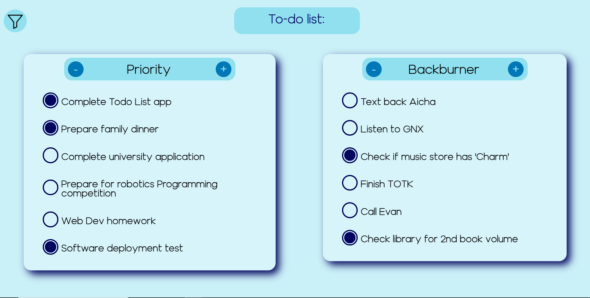
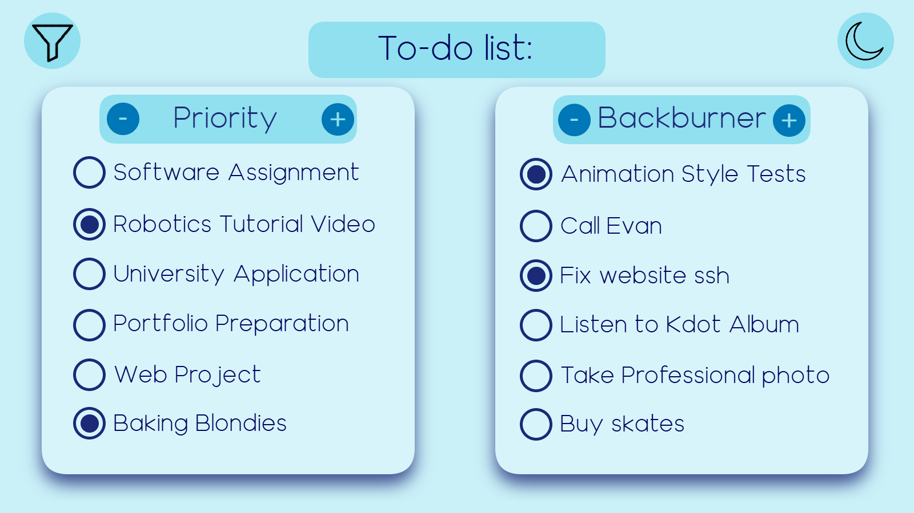
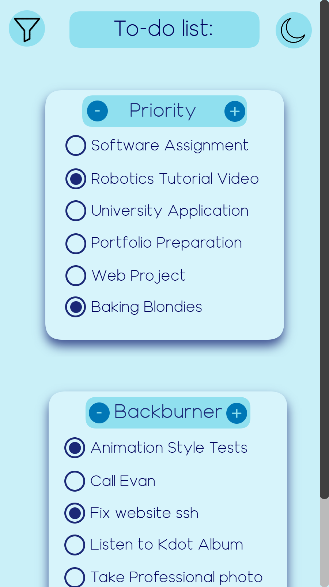

# Todo List Web App

A stylish react todo list app with persisting data in localstorage.

Deployed at: https://todo.nathanbokobza.com/

## Approach

I began by doing some preliminary research into typescript. Checking out the website, looking at the react documentation's mentions of TS, and I found a useful medium article which I based my folder structue off of for the project. From there, I designed the UI for vertical and horizontal layouts.

From there I began by making the components one by one along with the TS interfaces and linking them up. Afterwards I did the styling and implemented some features such as animation and that was it!

## Notes

- There are some instances where I am unsure if the typescript interfaces and parameters are best practice. This was my first application using TS so unlike React, I don't have a formal education on the subject.
- Due to the class structure, the types of lists (current defaults are Priority and Backburner) are totally modular and a user can hypothetically add their own lists akin to Trello. This has not yet been implemented due to it not being a requirement and me being more logistically comfortable with only two lists for now.

## Known issues / to implement

- Due to a mistake in how the state is handled, the checkbox buttons don't update correctly with their animation when the list is reordered. I am aware of how to fix it in a vacuum, but that current solution breaks the current localstorage solution.
- Dark mode is not implemented
- Filtering needs improved CSS

## Attributions

- Funnel Icon [link](https://www.flaticon.com/free-icons/funnel)